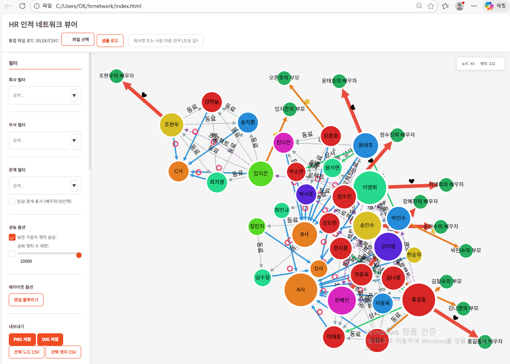

# HR 인적 네트워크 뷰어 - 완전 오프라인 SPA



## 개요

HR 인적 네트워크 뷰어는 완전 오프라인 단일 페이지 웹 애플리케이션(SPA)입니다. 사용자는 엑셀(XLSX) 또는 CSV 파일을 로컬에서 선택하여 로드하며, 데이터는 브라우저 메모리 내에서만 처리됩니다. 어떠한 외부 네트워크 전송도 발생하지 않습니다.

## 실행 방법

### 방법 1: 파일 더블클릭 (file://)

1. `index.html` 파일을 더블클릭하여 브라우저에서 열기
2. 파일 선택 또는 샘플 데이터 로드 버튼 클릭

### 방법 2: 사내 정적 호스팅

1. 전체 폴더를 웹 서버에 업로드
2. `index.html`에 접속

## 프로젝트 구조

```
hrnetwork/
├── index.html              # 메인 HTML (CSP 포함)
├── app.js                  # 메인 애플리케이션 로직
├── styles.css              # 스타일시트
├── libs/                   # 외부 라이브러리 (로컬 동봉)
│   ├── cytoscape.min.js
│   ├── cytoscape-fcose.js
│   ├── xlsx.full.min.js
│   └── papaparse.min.js
├── assets/                 # 자산 파일
├── samples/                # 샘플 데이터
│   ├── Nodes.csv
│   └── Edges.csv
└── README_offline.md       # 문서
```

## 데이터 스키마

### Nodes (노드) 필수 필드

- **id**: 노드의 고유 식별자 (필수)
- **label**: 노드의 표시 이름 (필수)
- **type**: 노드 타입 (필수)
  - `person`: 내부 직원
  - `company`: 회사
  - `external_person`: 외부 인물
  - `external_company`: 외부 회사

### Nodes 선택 필드

- **company**: 소속 회사
- **department**: 소속 부서
- **title**: 직함
- **birthdate**: 생년월일
- **last_updated**: 최종 업데이트 일자

### Edges (엣지) 필수 필드

- **source**: 출발 노드 ID (필수)
- **target**: 도착 노드 ID (필수)
- **relation**: 관계 유형 (필수)
  - `소속`: 회사 소속 관계
  - `배우자`: 배우자 관계
  - `친인척`: 친인척 관계
  - `동료`: 동료 관계
  - `상사`: 상사 관계
  - `부하`: 부하 관계
  - `프로젝트`: 프로젝트 협업 관계

### Edges 선택 필드

- **since**: 관계 시작 일자
- **note**: 비고
- **evidence**: 증거/참고 자료

## 매핑 위저드 사용법

매핑 위저드는 사용자가 임의의 컬럼명을 가진 엑셀/CSV 파일을 업로드할 때, 해당 컬럼을 표준 필드에 매핑하는 기능입니다.

### 사용 절차

1. **파일 선택**: Nodes 또는 Edges 파일을 선택
2. **자동 매핑 확인**: 시스템이 컬럼명을 분석하여 자동으로 매핑을 시도합니다
3. **수동 매핑**: 자동 매핑이 잘못된 경우, 드롭다운 메뉴에서 올바른 컬럼을 선택
4. **확인**: 모든 필수 필드가 매핑되었는지 확인 후 "확인" 버튼 클릭

### 예시

CSV 파일의 컬럼명이 다음과 같을 때:
- `사번` → `id`에 매핑
- `이름` → `label`에 매핑
- `타입` → `type`에 매핑
- `소속회사` → `company`에 매핑
- `부서명` → `department`에 매핑

### 관계 펼치기

여러 관계를 하나의 컬럼에 쉼표(`,`) 또는 슬래시(`/`) 또는 세미콜론(`;`)으로 구분하여 저장한 경우, "관계 펼치기" 기능이 자동으로 작동하여 각 관계를 별도의 엣지로 변환합니다.

예시:
- 입력: `관계1` 컬럼에 "배우자, 동료" 또는 "배우자/동료" 또는 "배우자;동료"
- 출력: 두 개의 엣지로 분리 (배우자 관계, 동료 관계)

## 유효성 검증

시스템은 다음 항목들을 자동으로 검증합니다:

1. **필수 필드 누락**: 필수 필드가 비어있는 경우 오류 리스트 표시
2. **공백 ID**: ID가 공백인 경우 오류 표시
3. **자기 자신 연결**: source와 target이 동일한 경우 오류 표시
4. **존재하지 않는 노드 참조**: source 또는 target이 노드 목록에 없는 경우 오류 표시

오류가 발생한 경우, 오류 메시지를 확인하고 데이터를 수정한 후 다시 업로드하세요.

## 검색 기능

### 한글 초성 검색

검색창에 한글 초성을 입력하면 해당 초성으로 시작하는 모든 단어를 찾습니다.

예시:
- `ㄱㄷ` 입력 → "김동수", "강대호" 등 검색
- `ㅎㄱㄷ` 입력 → "홍길동" 검색

### 부분 일치 검색

부분 일치 검색도 지원합니다.

예시:
- `홍길` 입력 → "홍길동" 검색
- `A사` 입력 → "A사" 포함된 모든 회사 검색

### 회사 모드

검색어가 회사명과 일치하면 자동으로 회사 모드로 전환됩니다.

회사 모드에서 표시되는 정보:
- 내부 직원 수
- 배우자를 통해 연결된 직원 목록
- 부서/직급 분포

### 사람 모드

검색어가 사람 이름과 일치하면 자동으로 사람 모드로 전환됩니다.

사람 모드에서 표시되는 정보:
- 소속 회사/부서/직함
- 배우자/친인척의 소속 회사 하이라이트
- "특정 회사까지 최단 경로" 버튼
- "배우자를 통해 연결된 회사 보기" 버튼

## 필터링 기능

### 회사 필터

체크박스를 통해 특정 회사만 표시할 수 있습니다.

### 부서 필터

체크박스를 통해 특정 부서만 표시할 수 있습니다.

### 관계 필터

체크박스를 통해 특정 관계 유형만 표시할 수 있습니다.

### 민감 관계 토글

민감한 관계 정보(배우자/친인척)는 기본적으로 숨겨져 있습니다. 토글을 활성화하면 경고 모달이 표시되고, 확인 후 민감 관계가 표시됩니다.

## 성능 옵션

### 낮은 가중치 엣지 숨김

체크박스를 활성화하면 가중치가 낮은 엣지(동료, 프로젝트 등)가 숨겨집니다.

### 상위 엣지 수 제한

슬라이더를 통해 표시할 최대 엣지 수를 제한할 수 있습니다. 가중치가 높은 엣지부터 표시됩니다.

## 내보내기 기능

### PNG 저장

현재 그래프 뷰를 PNG 이미지로 저장합니다.

### SVG 저장

현재 그래프 뷰를 SVG 벡터 이미지로 저장합니다.

### 선택 노드 CSV

선택한 노드(또는 전체 노드)를 CSV 형식으로 내보냅니다.

### 선택 엣지 CSV

선택한 엣지(또는 전체 엣지)를 CSV 형식으로 내보냅니다.

## 설정 저장/복원

### 설정 저장

현재 필터 설정, 성능 옵션, 색각보정 모드 등을 LocalStorage에 저장합니다.

### 설정 불러오기

이전에 저장한 설정을 불러옵니다.

### 초기화

모든 설정을 초기 상태로 되돌립니다.

## 접근성

### 키보드 접근

- Tab 키로 모든 버튼과 입력 필드에 접근 가능
- Enter 키로 검색 실행
- 포커스된 요소는 시각적으로 강조 표시

### 색각보정 모드

색각보정 모드를 활성화하면 색상의 채도와 명암이 강화되어 색각 이상이 있는 사용자도 구분하기 쉽습니다.

## 보안 정책

이 애플리케이션은 강력한 콘텐츠 보안 정책(CSP)을 적용합니다:

- **외부 통신 전면 차단**: `connect-src 'none'`
- **외부 스크립트 금지**: `script-src 'self'`
- **외부 스타일 금지**: `style-src 'self'`
- **외부 이미지 금지**: `img-src 'self' data: blob:`
- **외부 폰트 금지**: `font-src 'self' data:`

모든 데이터는 브라우저 메모리 내에서만 처리되며, 어떠한 외부 네트워크 전송도 발생하지 않습니다.

## 민감 데이터 정책

이 애플리케이션은 개인정보 보호 정책에 따라 민감한 관계 정보를 주의해서 사용해야 합니다:

- **배우자 관계**: 기본적으로 숨겨져 있으며, 토글 시 경고 모달 표시
- **친인척 관계**: 기본적으로 숨겨져 있으며, 토글 시 경고 모달 표시
- **데이터 저장**: 모든 데이터는 브라우저 메모리 내에서만 처리되며, 서버로 전송되지 않음
- **내보내기**: 사용자가 명시적으로 내보내기 버튼을 클릭하지 않는 한 데이터가 외부로 전송되지 않음

## 성능

이 애플리케이션은 다음 규모에서 원활하게 동작하도록 최적화되었습니다:

- **노드**: 최대 2,000개
- **엣지**: 최대 6,000개

성능 옵션을 조정하여 더 큰 규모의 데이터도 처리할 수 있습니다.

## 문제 해결

### 파일이 로드되지 않는 경우

- 파일 형식이 XLSX 또는 CSV인지 확인
- 파일이 손상되지 않았는지 확인
- 브라우저 콘솔에서 오류 메시지 확인

### 그래프가 표시되지 않는 경우

- Nodes와 Edges 파일이 모두 로드되었는지 확인
- 매핑 위저드에서 필수 필드가 모두 매핑되었는지 확인
- 유효성 검증 오류가 없는지 확인

### 검색이 작동하지 않는 경우

- 검색어가 올바른지 확인
- 한글 입력이 제대로 되었는지 확인
- 브라우저 콘솔에서 오류 메시지 확인

## 버전 정보

- **버전**: 1.0.0
- **최종 업데이트**: 2024-01-10
- **라이브러리 버전**:
  - Cytoscape.js: 3.30.0
  - cytoscape-fcose: 2.1.0
  - SheetJS (xlsx): 0.18.5
  - Papa Parse: 5.4.1

## 라이선스

이 프로젝트는 내부 사용 목적으로 개발되었습니다.

## 문의

문제가 발생하거나 개선 사항이 있으면 개발팀에 문의하세요.

